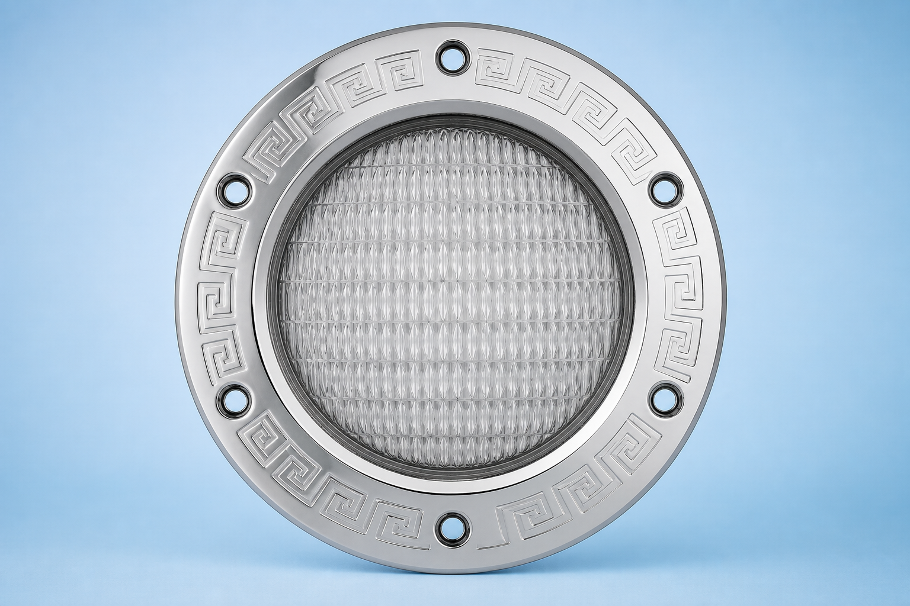

# Pool Light Card

Lovelace card for any **RGB `light`** entity — fixture artwork, color presets, brightness slider, power toggle, and a BLE-style connectivity badge (same look as the [Pool Cleaner Card](https://github.com/randrcomputers/ha-pool-cleaner-card)).

Works with **[iPool Light](https://github.com/randrcomputers/ha-ipool-light)** and other RGB pool lights.



## Install

1. **HACS** → **Frontend** → **Custom repositories** → add `https://github.com/randrcomputers/ha-pool-light-card`
2. **Frontend** → **Pool Light Card** → **Download**
3. **Settings** → **Dashboards** → **⋮** → **Reload resources**, then refresh the browser (**Ctrl+F5**)

## Pictures on Home Assistant

Copy files from the repo folder **`pool_card/`** into **`config/www/pool_card/`** on your HA host.

| File to copy | Example URL |
| --- | --- |
| **`pool_light_fixture.png`** (fixture, light on) | `/local/pool_card/pool_light_fixture.png` |
| **`light_control_box.png`** (control box, light off) | `/local/pool_card/light_control_box.png` |
| **`ipool_light.png`** (your product photo) | `/local/pool_card/ipool_light.png` |

See **`pool_card/README.md`** for all bundled images.

If the colored glow does not line up with your lens, adjust **Lens glow — top / left / size %** in the card editor.

## Add the card

Pick your **Light** entity in the UI, or YAML:

```yaml
type: custom:pool-light-card
entity: light.ipool_light
image: /local/pool_card/pool_light_fixture.png
image_control_box: /local/pool_card/light_control_box.png
show_fixture_when: auto
```

**Auto** shows the fixture while the light is on and the control box when off (like the pool cleaner robot / PSU swap).

Optional **Connected** binary sensor lights the BLE badge when `on`.

---

**Requirements:** Home Assistant 2024.1+ and a `light` entity with `rgb` color mode.
